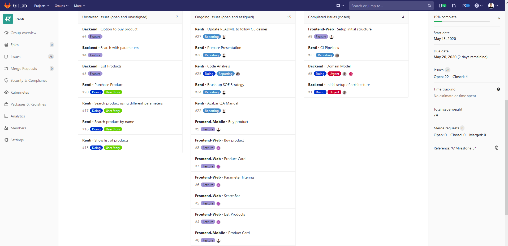
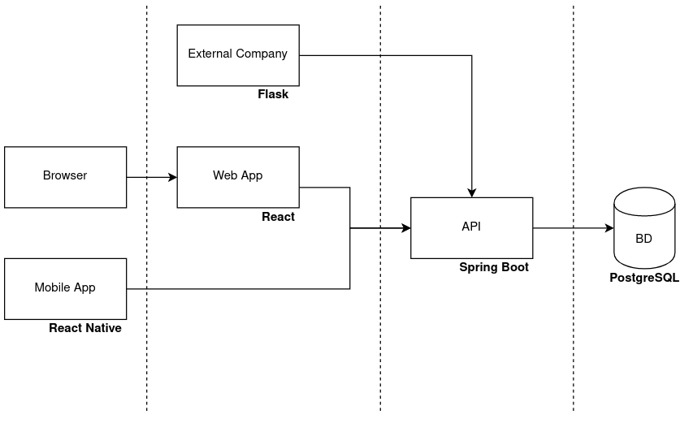

# Renti - Renting Marketplace

## Project Abstract

Aluguer de equipamentos
Todos temos mais equipamentos que não utilizamos do que realmente pensamos. Equipamentos esses que não queremos vender com medo de poder precisar deles no futuro, algo que leva a que os equipamentos se vão deteriorando e percam o seu valor. Por outro lado, temos muitos equipamentos que, provavelmente, só precisamos de usar 1 ou 2 vezes por ano, pelo que precisamos de os manter, mas podemos alugá-los no tempo restante.

Da perspetiva de um comprador, muitas vezes precisamos de equipamentos durante uma curta duração. Seja uma boa câmara fotográfica, um equipamento de DJ, uma cana de pesca. Ou até uma consola para um fim de semana com amigos.

Dado este problema, surge a ideia de criar uma plataforma do tipo online marketplace que sirva para aluguer de equipamentos, ou seja, em vez de o utilizador os vender ao cliente, faz um empréstimo durante X tempo.
Desta forma podemos: gastar menos, ajudar o ambiente e fazer dinheiro!

## Project Team

**Team manager**: Tomás Costa  
**DevOps master**: João Marques  
**Product owner**: Francisco Jesus  
**Developer**: Todos  

**Backend**: Francisco e João  
**Frontend**: Tomás e Miguel  

## Project Bookmarks (:WIP)

### Project Backlog
For backlog management we are using GitLab Boards and Milestones, assigning each task to a specific developer.  
We are experiencing GitLab instead of Jira, to expand our technology stack, and see how well it works.

### Related Repositories
This [group](https://gitlab.com/renti-software) is subdivided in 6 repositories:  

* Renti (Serves as main repository, for backlog management and reporting)  
* Backend  
* External API  
* Frontend-Mobile  
* Frontend-Web  
* Compose  

### API Documentation
 Still TBD

### Static Analysis
We are making use of static code analysis engines to evaluate our code quality and prevent errors.
As of the specific code quality metrics, we opted by using GitLab Code Quality.  

This set of tests use Code Climate Engines. This reports code errors, security problems,
vulnerabilities, code smells, and other errors based on common standards, and easily integrates it with
each commit and merge request in GitLab.  

This code analysis is then integrated with the Gitlab CI pipeline for the project, as explained ahead.
Having access to this tool allows us to identify errors we probably would miss otherwise, and to learn
how to write better code.

### CI/CD Environment
As in previous projects, we implemented a CI/CD workflow using Gitlab.  

On each commit made to the code repository, a pipeline is triggered. This pipeline is responsible for
conducting the previously mentioned code quality static analysis, and produce the respective report,
as well as conducting tests, building the source code into packages, and continuously deploying
the services.

### Arquitetura + Tecnologias

Tudo em containers Docker, gerido pelo Docker Compose.  

### Ferramentas e Práticas

**Gestão de versões**: GitLab  
**Testes**: (TBD) SpringBoot Tests + Selenium UI Test  
**Gestão de tarefas / Backlog**: Gitlab Boards ou Jira  
**CI/CD**: GitLab CI/CD  
**Monitorização**: Zabbix/Kibana e Slack  
