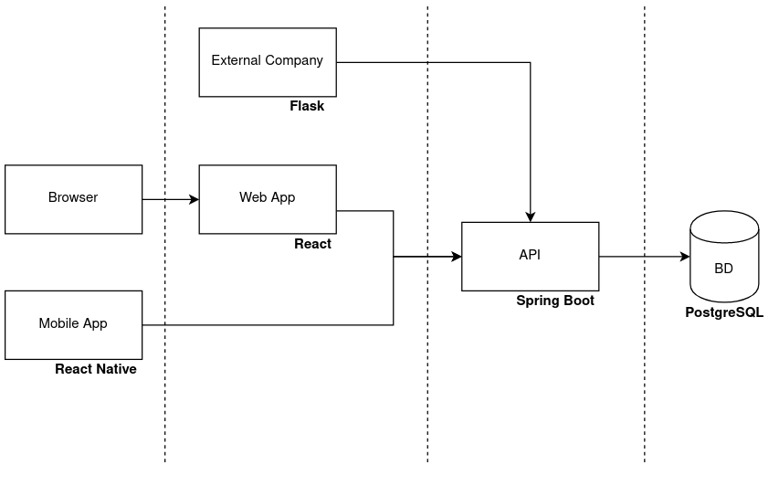

# Renti - Renting Marketplace

## Project Abstract

Aluguer de equipamentos
Todos temos mais equipamentos que não utilizamos do que realmente pensamos. Equipamentos esses que não queremos vender com medo de poder precisar deles no futuro, algo que leva a que os equipamentos se vão deteriorando e percam o seu valor. Por outro lado, temos muitos equipamentos que, provavelmente, só precisamos de usar 1 ou 2 vezes por ano, pelo que precisamos de os manter, mas podemos alugá-los no tempo restante.

Da perspetiva de um comprador, muitas vezes precisamos de equipamentos durante uma curta duração. Seja uma boa câmara fotográfica, um equipamento de DJ, uma cana de pesca. Ou até uma consola para um fim de semana com amigos.

Dado este problema, surge a ideia de criar uma plataforma do tipo online marketplace que sirva para aluguer de equipamentos, ou seja, em vez de o utilizador os vender ao cliente, faz um empréstimo durante X tempo.
Desta forma podemos: gastar menos, ajudar o ambiente e fazer dinheiro!

## Project Team

**Team manager**: Tomás Costa  
**DevOps master**: João Marques  
**Product owner**: Francisco Jesus  
**Developer**: Todos  

**Backend**: Francisco e João  
**Frontend**: Tomás e Miguel  

## Project Bookmarks (:WIP)

### Project Backlog
--

### Related Repositories
--

### API Documentation
--

### Static Analysis
--

### CI/CD Environment
--

### Arquitetura + Tecnologias

Tudo em containers Docker, gerido pelo Docker Compose.  

### Ferramentas e Práticas

**Gestão de versões**: GitLab  
**Testes**: (TBD) SpringBoot Tests + Selenium UI Test  
**Gestão de tarefas / Backlog**: Gitlab Boards ou Jira  
**CI/CD**: GitLab CI/CD  
**Monitorização**: Zabbix/Kibana e Slack  
